# adamant

> I'm a PM. I just shipped a fix to production without opening Jira.

<p align="center">
  
</p>

## Try it now

```bash
npx adamant-cli
```

No install. No API key. See what Adamant does in 30 seconds.

## How it works

You describe what's wrong with your product in plain English.
Adamant reads your code and opens a pull request.

| Today (without Adamant) | With Adamant |
|------------------------|--------------|
| User reports issue | You type one sentence |
| PM writes ticket | Adamant reads your codebase |
| PM writes spec | Adamant writes the fix |
| Engineer implements | Adamant opens a PR |
| Code review + merge | You review + merge |
| **~3 weeks** | **~60 seconds** |

## Setup

### 1. Install

```bash
npm install -g adamant-cli
```

Requires Node.js 18 or higher.

### 2. Get a Claude API key

Go to [console.anthropic.com](https://console.anthropic.com) and create an API key. Keys start with `sk-ant-`.

### 3. Set up GitHub access

Either install the [GitHub CLI](https://cli.github.com) and run `gh auth login`, or have a [personal access token](https://github.com/settings/tokens) ready with `repo` scope.

### 4. Run first-time setup

```bash
adamant
```

Adamant will walk you through entering your API key and GitHub token. Takes about 30 seconds. Config is stored at `~/.adamant/config.json`.

---

## Examples

```bash
# Fix a UX problem
adamant wish "users keep abandoning checkout at step 3"

# Improve error handling
adamant wish "the error messages are confusing and don't explain what to do"

# Speed things up
adamant wish "loading is too slow on the dashboard"

# Mobile issues
adamant wish "the settings page is broken on mobile"
```

## What you get

A draft PR on GitHub with:
- Code changes in the right files
- A description written for PMs, not engineers
- Expected user impact

You review. You merge. Done.

---

## Commands

### `adamant wish "<description>"`

Describe what you want changed in plain English. Adamant reads your repo, writes the fix, and opens a draft PR.

```bash
adamant wish "the error messages are confusing"
```

**Flags:**

| Flag | Description |
|------|-------------|
| `--preview` | Show the diff and PR description before creating the PR |
| `--dry-run` | Show what would change without creating a branch or PR |
| `--yes` / `-y` | Skip the cost confirmation prompt |
| `--model <model>` | Use a specific Claude model (see Models section below) |
| `--ready` | Create the PR as ready for review instead of a draft |
| `--local` | Apply changes locally without creating a branch or PR |
| `--file <path>` | Focus on a specific file or directory |

```bash
# Preview changes before submitting
adamant wish "loading is too slow on the dashboard" --preview

# Skip confirmation, no PR created
adamant wish "fix the mobile layout" --dry-run

# Skip cost confirmation
adamant wish "improve error messages" --yes

# Use a more powerful model for complex changes
adamant wish "refactor the checkout flow" --model claude-opus-4-6

# Open PR as ready for review (not a draft)
adamant wish "fix typo in settings page" --ready

# Apply changes locally without creating a PR
adamant wish "fix the save button" --local

# Focus on a specific file
adamant wish "fix the save button" --file src/components/Settings.tsx
```

---

### `adamant log`

View your wish history - every wish you've made, the PR it opened, and what it cost.

```bash
adamant log
```

**Flags:**

| Flag | Description |
|------|-------------|
| `--stats` | Show aggregated stats (total wishes, PRs opened, total cost) |

```bash
adamant log --stats
```

---

### `adamant config`

View your current settings.

```bash
adamant config
```

**Flags:**

| Flag | Description |
|------|-------------|
| `--reset` | Wipe your config and run the setup wizard again |

```bash
# Re-run setup (e.g. to update your API key or GitHub token)
adamant config --reset
```

---

## Models

| Model | Flag value | Speed | Cost per wish | Best for |
|-------|-----------|-------|---------------|----------|
| Claude Sonnet 4.6 *(default)* | `claude-sonnet-4-6` | Fast | ~$0.20 | Most wishes |
| Claude Opus 4.6 | `claude-opus-4-6` | Slower | ~$1.00 | Complex or large codebases |
| Claude Haiku 4.5 | `claude-haiku-4-5-20251001` | Fastest | ~$0.05 | Simple, focused changes |

Switch models per-wish with `--model`:
```bash
adamant wish "redesign the onboarding flow" --model claude-opus-4-6
```

---

## FAQ

**How much does it cost?**
~$0.20 per wish using the default model. You use your own Claude API key and pay Anthropic directly. Adamant itself is free.

**Will it break my code?**
No. PRs are drafts by default. You review everything before merging. Use `--dry-run` to preview changes without creating anything.

**Is it just Claude Code with extra steps?**
No. Claude Code speaks engineer. Adamant speaks product. You say "checkout abandonment" not "refactor CartCheckout.tsx." The translation is the product.

**Can I change the default model?**
Not via a config flag yet, but you can pass `--model` on any wish. Run `adamant config --reset` to re-run setup if you want to reconfigure your key or token.

**What if I have uncommitted changes?**
Adamant will auto-stash them before running and restore them after. You'll see a note in the output when this happens.

## Roadmap

### V1.1

- **Preview shows PR description first.** The plain-English summary before the diff.
- **Failed wish memory.** Adamant learns from wishes that don't land.
- **`adamant undo`** - closes the last PR and reverts the branch.
- **Remote prompt loading.** `adamant login` creates a free account. 10 wishes/month free.

### V2 - Proxy Mode

No Claude API key needed. The CLI sends wishes to the Adamant API. You pay per wish.

- **Adamant-hosted AI.** System prompt lives server-side. You never touch Claude directly.
- **Pay per wish.** No subscription. No API key setup.
- **30-second onboarding.** Install, login, wish. That's it.

### Later

- **Chrome extension + CLI.** See a problem in the browser, click "wish", get a PR.
- **`adamant fix <PR-URL>`** - fix stale or conflicted PRs.
- **`adamant scan`** - find UX friction in your code before users report it.
- **Linear + Slack integration.** Wishes from tickets and messages.
- **`--json` output.** Structured output for scripting and dashboards.

[Open an issue](https://github.com/BoluOgunbiyi/adamant-cli/issues) to influence what ships next.

---

## Requirements

- Node.js 18+
- A Claude API key ([get one here](https://console.anthropic.com))
- GitHub access (via `gh` CLI or personal access token with `repo` scope)

## License

MIT
